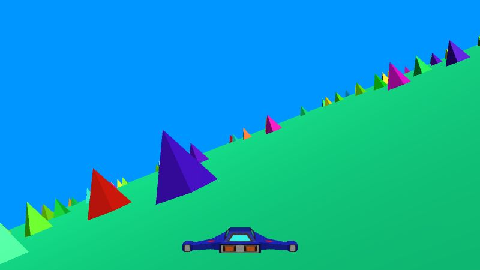

# Year of Unity - January: JSlalom

My first (monthly?!) game of 2022, a clone of *JetSlalom*. I can't find the original game itself, but [here is a video review](https://www.youtube.com/watch?v=nci7UsHXTJo).

## Goals
Aside from gaining a better understanding of Unity, there were a few key targets for the development of this JetSlalom clone:

#### Matching the original feel of movement
The original game has a notable weightiness to it when turning, which I wanted to mimic. Importantly, turning is not instant and there is a very long delay to recover back to normal after releasing the turn. Visually, turns rotate the world and not the player, making the turns feel more dramatic.

For the most part, I think this is captured in my version, though the tuning may be a bit off.

#### Multiple obstacle spawning patterns
In the original game, there are at least 3 distinct styles of obstacle placement (maybe more, but I could never survive long enough to see them!). The first pattern is just random placement, I'd guess uniformly, though the rate at which obstacles spawn would increase over time. The second pattern is a corridor style placement, where pairs of obstacles are spawned in a smooth weaving pattern, which confine the player to a narrow region. The last pattern is a variant of the random placement, but included multiple sizes of obstacle. 

Again, I think I managed to capture the different spawning styles reasonably well, though the overall feel is a bit different. The corridor spawning in the original is definitely smoother and tends to provide more opportunities to turn at full speed. To be able to better match this (in the hypothetical future), I would need to invest time in building editor tools for myself, so that I could see full spawning patterns without having to playthrough them every time I make changes!

#### Easy stage editing/ordering
This was a development workflow goal, rather than anything meant to match the original. The idea was to structure the codebase so that the sequence of obstacle spawning patterns and parameters could be easily modified as 'data' as opposed to 'code' (i.e. changes to the level sequence shouldn't require edits to magic numbers or constants in the code). This was easily the most difficult part of the game, and probably accounted for over 80% of the development time. Ultimately, I think I still did a poor job of this, and would like to revisit it again once I have a better understanding of Unity and how to organize game code.

## Future work
It turns out I have no idea what I'm doing, so to make the end-of-January deadline, a bunch of content was cut - mostly graphical upgrades. In case I revisit this game, here are a few reminders of ideas that got canned:
- Improved player (jet) model & texturing
- Add fire-like particle effects to the back of the jet
- Transparency/see-through rendering of obstacles that get between the camera and player
- Player reactions & sound when a near-miss occurs (for example, a whoosing sound and a wobbly animation on the player model)
- Better death animation. Ideally have a physical simulation on impact (i.e. have the player model and/or obstacle shatter and fly off in pieces)
- Procedurally generated ground texture and geometry through shaders